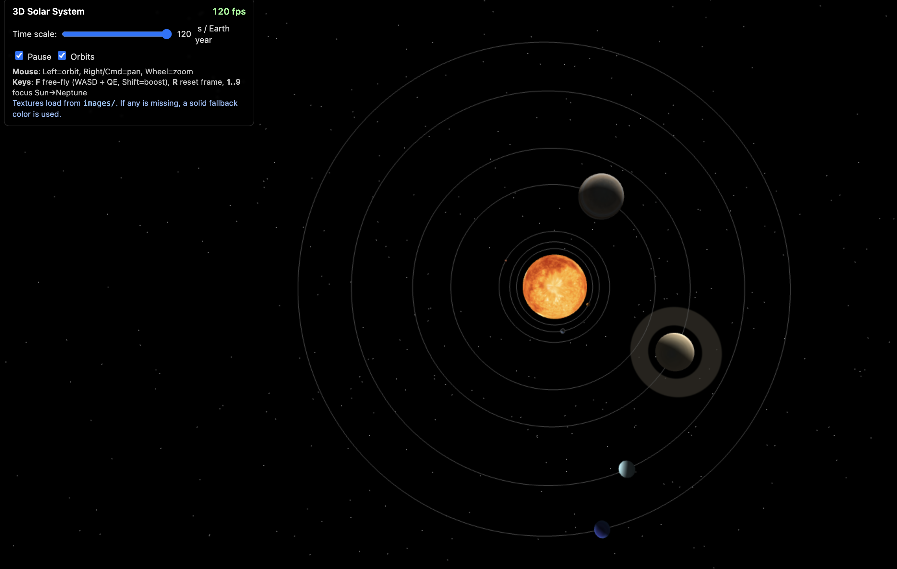
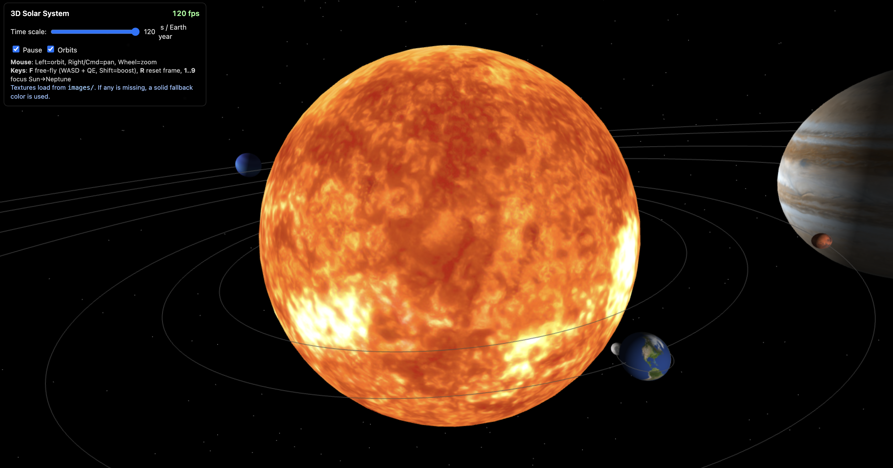

# Milky Way Solar System — Vanilla JS/WebGL

A single-file WebGL demo that renders a small, interactive solar system. It uses textured spheres for the Sun and planets, a moon orbiting Earth, Saturn’s rings, a star field, simple lighting, and an auto-fit camera for a good initial view.

## What you’ll see

- Sun and 8 planets with textures (local images with graceful fallback colors)
- Earth’s Moon (simple circular orbit)
- Saturn’s ring mesh with translucency
- Star field (thousands of point sprites that scale by distance)
- Subtle Sun glow (billboarded quad)
- Simple Lambert lighting for planets, unlit for Sun
- Auto-fit camera that starts with all planets in view

## Screenshots





## Controls

- Mouse: Left-drag to orbit the camera around the Sun; Scroll to zoom
- Keyboard: R to reset the view (auto-fit)
- HUD UI:
  - Time scale slider (seconds per Earth year)
  - Pause toggle
  - Debug orbits toggle (wireframe orbit lines)

## Run locally

You can usually open `index.html` directly in your browser. If your browser blocks textures from the file system, serve the folder with a simple static server.

Optional static servers (pick one):

```bash
# Python 3 (built-in)
python3 -m http.server 5500

# Node (npx)
npx serve -l 5500
```

Then open: [http://localhost:5500/](http://localhost:5500/)

## Project layout

- `index.html` — All rendering, shaders, input, UI, and scene logic (single-file app)
- `images/` — Texture files (sun, planets, moon)
- `download_textures.js` / `scripts.sh` — Helpers to fetch textures (optional)

## How it works (quick technical tour)

- Minimal math: small mat4/vec utilities for transforms, perspective, and lookAt
- Shaders:
  - Textured + lit planets (`vsCommon` + `fsTexturedLit`)
  - Unlit textured Sun (`fsUnlit`) plus a soft glow billboard
  - Rings shader with alpha falloff and lighting
  - Stars as GL points with a radial fade fragment shader
- Geometry:
  - Parametric sphere (shared by Sun/planets/moon)
  - Flat ring mesh for Saturn
  - Orbit lines (optional) as line strips
- Camera:
  - Spherical orbit camera centered on the Sun (panning disabled)
  - Auto-fit on load/resize via a system bounding radius and the current FOV
  - Current FOV is 60°, near/far set to 0.1/10000
- Scales (artistic, not to real scale):
  - `PLANET_SCALE = 8` (visual size multiplier; Earth ≈ 8 units)
  - `AU = 15` (visual orbit radii scale)
  - Orbit radii are compressed: `scaledOrbit(au) = sqrt(au) * AU`
  - Sun visual radius = `1.7` (smaller to keep the initial frame readable)

## Tips & troubleshooting

- Press R anytime to auto-fit the system into view
- If you see colored spheres instead of textures, the image couldn’t be loaded
  - Ensure files exist under `images/` (see texture names inside `index.html`)
  - Serving via a local server avoids file:// restrictions
- Black screen or console errors: check WebGL support and shader compile logs
- Resize the window: the canvas auto-resizes; if you haven’t moved the camera,
  it will re-fit to keep everything visible

## Notes

The scene is intentionally not to physical scale; sizes and distances are tuned
  for clarity so that all major bodies are visible together on screen.


## PROMPT GPT5: original spec

Create a single self-contained HTML file (index.html) that renders a 3D Solar System using vanilla JavaScript + WebGL 1.0 (no external libraries). The user must be able to orbit, pan, zoom, and free-fly the camera. All planets and the Sun must be visible on screen at start and after window resizes. Distances and sizes are intentionally non-realistic (compressed) but keep approximate proportions.

### Assets (local only)

Load textures from images/ (no hotlinks). If a texture fails, render a solid fallback color.

- images/sun.jpg
- images/mercury.jpg
- images/venus.jpg
- images/earth.jpg
- images/moon.jpg
- images/mars.jpg
- images/jupiter.jpg
- images/saturn.jpg
- images/uranus.jpg
- images/neptune.jpg

### Scene & visuals

- Procedural starfield (GL points with size attenuation).
- Sun: textured, rendered unlit + additive billboard glow (camera-facing quad).
- Planets: textured, Lambert-lit spheres, with axial tilt and self-rotation.
- Saturn ring: translucent ring mesh with soft fade on inner/outer edges.
- Optional orbit lines (toggle).

### Simulation (approximate)

- Bodies: Sun, Mercury → Neptune, plus Moon around Earth.
- Use these fields per body: radius (Earth=1), orbitDays, rotHours, tilt.
- Revolution around the Sun (circular, ecliptic plane) and rotation about axis.
- Moon: orbit Earth with its own rotation & tilt.
- UI: Time scale slider (seconds per Earth year) + Pause checkbox.

### Non-realistic scaling (everything must fit)

- Compress orbit radii with e.g. `scaledOrbit = sqrt(au) * AU_SCALE`.
- Compress visual sizes with e.g. `planetVisual = radius * EARTH_VISUAL_SCALE`.
- Pick constants (e.g. `AU_SCALE ≈ 35`, `EARTH_VISUAL_SCALE ≈ 6`) that make all bodies fit comfortably.
- Maintain rough relative size ordering (Jupiter > Saturn > … > Mercury/Moon).

### Camera (auto-fit & controls)

- On load and on resize, auto-compute a bounding radius: `max(b.orbitR + planetVisual(b))`.
- Compute camera distance from FOV (vertical & horizontal) so the whole system fits with ~10–20% margin.
- Start with Sun centered, angled view; R resets to this framing.
- Mouse:
	- Left-drag orbit, Right-drag/Cmd-drag pan, Scroll zoom (exponential).
- Keyboard:
	- F toggles free-fly (WASD + QE up/down, Shift = speed boost).
	- 1..9 focus Sun, Mercury…Neptune with a short eased camera move.

### WebGL details

- Build parametric sphere (lat/lon). Use `ELEMENT_ARRAY_BUFFER` with `UNSIGNED_SHORT` indices.
- Minimal mat4 helpers (identity, mul, translate, scale, rotateXYZ, perspective, lookAt).
- Shaders:
	- Planet VS/FS: normals, UVs, single point light at Sun.
	- Unlit textured shader for Sun core.
	- Ring shader (fade by UV.x; simple lambert).
	- Star shader: sets `gl_PointSize` (NOT `gl.PointSize`).
- Texturing: mipmaps, `LINEAR_MIPMAP_LINEAR`, sensible wraps.
- Render order: stars (no depth write) → planets/rings (depth test on) → sun glow last (additive, no depth write).
- If any texture fails, the object must still render via fallback color.

### UI (small HUD)

- Controls legend
- Time scale slider + live value
- Pause checkbox
- Debug orbits checkbox
- Note “textures load from images/ with colored fallbacks”

### Data (ok to approximate)

- Orbit periods (days): 88, 224.7, 365.25, 687, 4331, 10747, 30687, 60190; Moon 27.32.
- Day lengths (hours): 1407.6, −5832.5, 23.93, 24.62, 9.93, 10.7, −17.2, 16.11; Moon 655.7.
- Tilts (deg): 0.03, 177.4, 23.44, 25.19, 3.13, 26.73, 97.77, 28.32; Moon 6.68.
- Radii (Earth=1): 0.383, 0.949, 1, 0.532, 11.21, 9.45, 4.01, 3.88; Moon 0.2724.
- AU for scaledOrbit: 0.39, 0.72, 1.00, 1.52, 5.20, 9.58, 19.2, 30.05.

### Acceptance criteria

- Opening the file locally shows all planets + Sun on screen by default.
- Resizing the window keeps everything visible (auto-fit recomputes).
- R resets to the same auto-fit view.
- Mouse/keyboard controls work; free-fly toggles with F.
- No WebGL errors; sphere indices use `UNSIGNED_SHORT`.
- If textures are missing, bodies still render with colors.